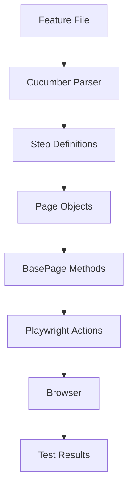

## What is E2E Testing?

End-to-end (E2E) testing in the Contalink Test Framework validates the application from the user's perspective, simulating real-world scenarios across the entire system. This ensures that all components work together correctly and that critical user workflows function as expected.

The framework combines **Playwright** for browser automation with **Cucumber** for behavior-driven development (BDD), allowing tests to be written in natural language that both technical and non-technical stakeholders can understand.

## Playwright Integration

The framework uses [Playwright](https://playwright.dev/) as its core testing engine, providing powerful browser automation capabilities:

- **Cross-browser testing**: Tests run on Chromium, Firefox, and WebKit
- **Auto-waiting**: Playwright automatically waits for elements to be ready
- **Network interception**: Control and monitor network requests
- **Screenshots and videos**: Capture test execution for debugging
- **Trace viewer**: Debug failed tests with detailed execution traces

### Configuration

The Playwright configuration is defined in `playwright.config.ts` at the project root:

```typescript
export default defineConfig({
  testDir: './integration',
  fullyParallel: true,
  forbidOnly: !!process.env.CI,
  retries: process.env.CI ? 2 : 0,
  workers: process.env.CI ? 1 : undefined,
  reporter: 'html',
  use: {
    baseURL: process.env.HOST_PAGE,
    trace: 'on-first-retry',
    headless: false,
  },
  projects: [
    { name: 'chromium', use: { ...devices['Desktop Chrome'] } },
    { name: 'firefox', use: { ...devices['Desktop Firefox'] } },
    { name: 'webkit', use: { ...devices['Desktop Safari'] } },
  ],
});
```

## Browser Support

The framework supports three major browser engines:

<CardGroup cols={3}>
  <Card title="Chromium" icon="chrome">
    Desktop Chrome configuration for Chromium-based browsers
  </Card>
  <Card title="Firefox" icon="firefox">
    Desktop Firefox configuration for Mozilla browsers
  </Card>
  <Card title="WebKit" icon="safari">
    Desktop Safari configuration for WebKit-based browsers
  </Card>
</CardGroup>

### Mobile Testing

While currently commented out, the configuration supports mobile viewport testing:

- **Mobile Chrome**: Pixel 5 device emulation
- **Mobile Safari**: iPhone 12 device emulation

To enable mobile testing, uncomment the mobile projects in `playwright.config.ts`.

## Test Execution Flow

The E2E testing framework follows this execution flow:



### Execution Steps

1. **BeforeAll Hook**: Launches the browser instance
2. **Before Hook**: Creates a new browser context and page for each scenario
3. **Scenario Execution**: Runs Gherkin steps mapped to step definitions
4. **Page Object Actions**: Step definitions use page objects to interact with the UI
5. **After Hook**: Closes the page to clean up the session
6. **AfterAll Hook**: Closes the browser when all tests complete

## Test Structure

The E2E tests are organized in the `tests/` directory:

```
tests/
├── features/           # Gherkin feature files
│   ├── login.feature
│   ├── invoices.feature
│   └── backTest.feature
├── pages/              # Page object models
│   ├── BasePage.ts
│   ├── LoginPage.ts
│   └── invoicesPage.ts
└── steps/              # Step definitions and hooks
    ├── Hooks.ts
    ├── loginSteps.ts
    └── invoicesSteps.ts
```

## Environment Configuration

Tests use environment variables for configuration:

```bash
HOST_PAGE=https://your-app.com  # Base URL for the application
QA_PASSWORD=your_password       # Password for test authentication
```

These variables are loaded from the `.env` file in the project root using `dotenv`.

## Running Tests

<CodeGroup>
```bash npm
npm run test:e2e
```

```bash yarn
yarn test:e2e
```

```bash Cucumber CLI
npx cucumber-js
```
</CodeGroup>

## CI/CD Optimization

The configuration includes CI-specific settings:

- **Retry logic**: Automatically retries failed tests twice in CI environments
- **Sequential execution**: Runs tests with a single worker to prevent race conditions
- **Headless mode**: Can be configured for headless execution in CI pipelines
- **Fail-fast**: Prevents `.only` tests from being committed

## Learn More

Explore the E2E testing framework in detail:

<CardGroup cols={2}>
  <Card title="Page Object Model" icon="cube" href="/e2e/page-object-model">
    Learn about the POM pattern and BasePage implementation
  </Card>
  <Card title="Writing Tests" icon="code" href="/e2e/writing-tests">
    Best practices for writing E2E tests with examples
  </Card>
  <Card title="Gherkin Features" icon="file-lines" href="/e2e/gherkin-features">
    Understand BDD syntax and feature file structure
  </Card>
  <Card title="Test Hooks" icon="gears" href="/e2e/writing-tests#test-hooks">
    Manage test lifecycle with hooks
  </Card>
</CardGroup>

## Best Practices

<AccordionGroup>
  <Accordion title="Use Page Objects">
    Always interact with the UI through page objects to maintain clean, reusable code. See the [Page Object Model](/e2e/page-object-model) guide.
  </Accordion>
  
  <Accordion title="Write Descriptive Scenarios">
    Use clear, business-focused language in feature files. See [Gherkin Features](/e2e/gherkin-features) for examples.
  </Accordion>
  
  <Accordion title="Isolate Test Data">
    Each test should create and clean up its own data to ensure test independence.
  </Accordion>
  
  <Accordion title="Use Environment Variables">
    Never hardcode sensitive data or URLs. Use environment variables for configuration.
  </Accordion>
</AccordionGroup>