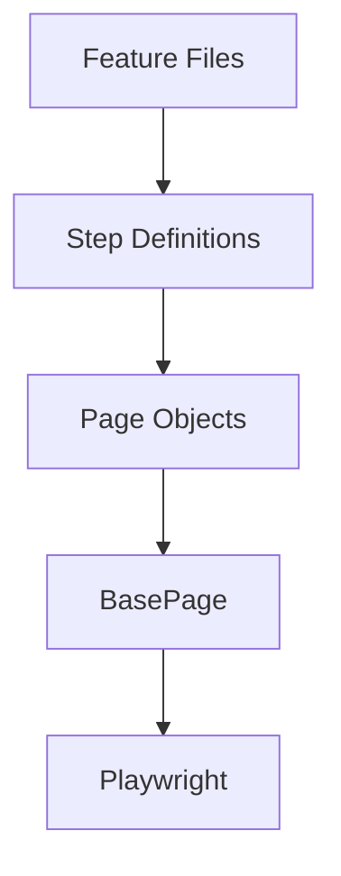

## Test Architecture

E2E tests in the Contalink framework follow a layered architecture:



- **Feature Files**: Written in Gherkin, describe test scenarios in business language
- **Step Definitions**: Map Gherkin steps to executable code
- **Page Objects**: Encapsulate page interactions and selectors
- **BasePage**: Provides common functionality for all pages
- **Playwright**: Executes browser automation

## Using Page Objects

Page objects are the primary way to interact with the application UI in tests.

### Importing Page Objects

```typescript
import { page } from './Hooks';
import { LoginPage } from '../pages/LoginPage';
import { InvoicesPage } from '../pages/invoicesPage';
```

### Initializing Page Objects

Page objects should be initialized in step definitions:

```typescript
let loginPage: LoginPage;
let invoicesPage: InvoicesPage;

Given('que estoy en la página de login', async function () {
  loginPage = new LoginPage(page);
  const hostPage = process.env.HOST_PAGE;
  await loginPage.navigateTo(hostPage as string);
});
```

### Calling Page Methods

Step definitions call page object methods to perform actions:

```typescript
When('ingreso una contraseña {string}', async function (password: string) {
  await loginPage.enterPassword(password);
  await loginPage.clickSubmit();
});
```

### Validation with Page Objects

```typescript
Then('valido mensaje de error {string}', async function (expectedMessage: string) {
  await loginPage.validateErrorMessage(expectedMessage);
});
```

## Common Test Patterns

### Pattern 1: Simple Navigation and Action

Basic test flow with navigation, action, and validation:

```typescript
Given('que estoy en la página de login', async function () {
  loginPage = new LoginPage(page);
  await loginPage.navigateTo(process.env.HOST_PAGE as string);
});

When('ingreso la contraseña correcta', async function () {
  const correctPassword = process.env.QA_PASSWORD as string;
  await loginPage.enterPassword(correctPassword);
  await loginPage.clickSubmit();
});

Then('valido que se redirige a la página principal', async function () {
  const expectedUrl = process.env.HOST_PAGE + '/' as string;
  const currentUrl = loginPage.getPage().url();
  expect(currentUrl).toBe(expectedUrl);
});
```

### Pattern 2: Data Tables

Using Cucumber data tables for structured input:

```typescript
When('realizo la creación de una factura con los siguientes datos:', async function (dataTable) {
  await invoicesPage.clickCreateInvoice();
  const invoiceData = dataTable.rowsHash();
  await invoicesPage.fillInvoiceForm(invoiceData);
  await invoicesPage.clickSaveButton();
  await invoicesPage.findInvoiceInListCreated(invoiceData['Número']);
});
```

Corresponding Gherkin:

```gherkin
When realizo la creación de una factura con los siguientes datos:
  | Campo  | Valor    |
  | Número | 9999999  |
  | Monto  | 100.00   |
  | Estado | Vigente  |
```

### Pattern 3: Reusable Login

Create a reusable login step for tests that require authentication:

```typescript
Given('realizo un login para facturas', async function () {
  loginPage = new LoginPage(page);
  invoicesPage = new InvoicesPage(page);
  await loginPage.loginWithPassword();
});
```

This pattern:
- Initializes required page objects
- Performs complete login workflow
- Leaves the user ready to perform authenticated actions

### Pattern 4: Dialog Handling

Handling browser dialogs (alerts, confirms, prompts):

```typescript
Then('realizo la eliminación y confirmación de la factura con el número {string}', 
  async function (invoiceNumber) {
    await invoicesPage.findInvoiceInListCreated(invoiceNumber);

    page.on('dialog', async dialog => {
      console.log(dialog.message());
      await dialog.accept(); // Accept the alert
    });

    await invoicesPage.optionInvoice('Eliminar');
    await invoicesPage.findInvoiceInListCreated(invoiceNumber);
    
    const noResultsText = await page.locator('text=No se encontraron facturas').innerText();
    expect(noResultsText).toBe('No se encontraron facturas');
});
```

<Note>
  Dialog listeners must be set up **before** the action that triggers the dialog.
</Note>

### Pattern 5: Multi-Step Workflows

Complex workflows that span multiple pages:

```typescript
When('realizo la edición de una factura con los siguientes datos:', async function (dataTable) {
  const invoiceData = dataTable.rowsHash();
  
  // Step 1: Find and open editor
  await invoicesPage.optionInvoice('Editar');
  
  // Step 2: Fill form
  await invoicesPage.fillInvoiceForm(invoiceData);
  
  // Step 3: Save changes
  await invoicesPage.clickUpdateInvoiceButton();
  
  // Step 4: Verify in list
  await invoicesPage.findInvoiceInListCreated(invoiceData['Número']);
});
```

## Test Hooks

Hooks manage the test lifecycle and browser state.

### Location

`tests/steps/Hooks.ts`

### Implementation

```typescript
import { Before, After, BeforeAll, AfterAll } from '@cucumber/cucumber';
import { chromium, Browser, BrowserContext, Page } from '@playwright/test';

let browser: Browser;
export let page: Page;

BeforeAll(async () => {
  browser = await chromium.launch({ headless: true });
});

Before(async function() {
  const context = await browser.newContext();
  page = await context.newPage();
});

After(async function() {
  await page.close();
});

AfterAll(async () => {
  await browser.close();
});
```

### Hook Lifecycle

<Steps>
  <Step title="BeforeAll">
    Runs once before all scenarios. Launches the browser instance that will be reused across all tests.
    
    ```typescript
    BeforeAll(async () => {
      browser = await chromium.launch({ headless: true });
    });
    ```
  </Step>
  
  <Step title="Before">
    Runs before each scenario. Creates a fresh browser context and page, ensuring test isolation.
    
    ```typescript
    Before(async function() {
      const context = await browser.newContext();
      page = await context.newPage();
    });
    ```
  </Step>
  
  <Step title="After">
    Runs after each scenario. Closes the page to clean up resources and session data.
    
    ```typescript
    After(async function() {
      await page.close();
    });
    ```
  </Step>
  
  <Step title="AfterAll">
    Runs once after all scenarios. Closes the browser instance completely.
    
    ```typescript
    AfterAll(async () => {
      await browser.close();
    });
    ```
  </Step>
</Steps>

### Why This Architecture?

<CardGroup cols={2}>
  <Card title="Test Isolation" icon="shield">
    Each scenario gets a fresh browser context, preventing test pollution and ensuring independence.
  </Card>
  
  <Card title="Performance" icon="gauge-high">
    Reusing the browser instance across tests is faster than launching a new browser for each scenario.
  </Card>
  
  <Card title="Clean State" icon="broom">
    Session data, cookies, and local storage are cleared between scenarios.
  </Card>
  
  <Card title="Resource Management" icon="memory">
    Proper cleanup prevents memory leaks and ensures resources are released.
  </Card>
</CardGroup>

### Customizing Hooks

You can add custom hooks for specific scenarios:

```typescript
// Run only for scenarios tagged with @slow
Before({tags: '@slow'}, async function() {
  this.timeout = 60000; // Increase timeout
});

// Capture screenshot on failure
After(async function(scenario) {
  if (scenario.result?.status === 'failed') {
    const screenshot = await page.screenshot();
    this.attach(screenshot, 'image/png');
  }
});
```

## Environment Variables

Tests use environment variables for configuration:

```typescript
import 'dotenv/config';

const hostPage = process.env.HOST_PAGE as string;
const password = process.env.QA_PASSWORD as string;
```

### Required Variables

| Variable | Description | Example |
|----------|-------------|----------|
| `HOST_PAGE` | Base URL of the application | `https://app.contalink.com` |
| `QA_PASSWORD` | Test account password | `TestPass123!` |

### .env File

```bash
HOST_PAGE=https://your-app.com
QA_PASSWORD=your_secure_password
```

<Warning>
  Never commit the `.env` file to version control. Add it to `.gitignore`.
</Warning>

## Assertions and Validation

### Using Playwright Expect

```typescript
import { expect } from '@playwright/test';

Then('valido que se redirige a la página principal', async function () {
  const expectedUrl = process.env.HOST_PAGE + '/' as string;
  const currentUrl = loginPage.getPage().url();
  expect(currentUrl).toBe(expectedUrl);
});
```

### Common Assertions

<CodeGroup>
```typescript URL Validation
expect(page.url()).toBe('https://expected-url.com');
```

```typescript Text Content
const text = await page.textContent('.message');
expect(text).toContain('Success');
```

```typescript Visibility
await expect(page.locator('.modal')).toBeVisible();
```

```typescript Count
await expect(page.locator('.item')).toHaveCount(5);
```
</CodeGroup>

### Page Object Validations

Page objects can include validation methods:

```typescript
// In page object
async validateInvoiceCreation(invoiceData: { [key: string]: string }): Promise<void> {
  await this.expectText('tbody > :nth-child(1) > :nth-child(2)', invoiceData['Número']);
  await this.expectText('tbody > :nth-child(1) > :nth-child(3)', invoiceData['Monto']);
  await this.expectText('tbody > :nth-child(1) > :nth-child(5)', invoiceData['Estado']);
}

// In step definition
Then('valido que la creación de la factura con los datos ingresados:', 
  async function (dataTable) {
    const invoiceData = dataTable.rowsHash();
    await invoicesPage.validateInvoiceCreation(invoiceData);
});
```

## Best Practices

### 1. Keep Step Definitions Thin

Step definitions should primarily orchestrate page object calls:

<CodeGroup>
```typescript Good
When('ingreso una contraseña {string}', async function (password: string) {
  await loginPage.enterPassword(password);
  await loginPage.clickSubmit();
});
```

```typescript Avoid
When('ingreso una contraseña {string}', async function (password: string) {
  await page.fill('#password', password);
  await page.click('button[type="submit"]');
  await page.waitForTimeout(2000);
});
```
</CodeGroup>

### 2. Use Descriptive Variable Names

```typescript
// Good
const invoiceData = dataTable.rowsHash();
const expectedUrl = process.env.HOST_PAGE + '/';

// Avoid
const data = dataTable.rowsHash();
const url = process.env.HOST_PAGE + '/';
```

### 3. Handle Async/Await Properly

Always use `async/await` for asynchronous operations:

```typescript
// All step definitions should be async
Given('que estoy en la página de login', async function () {
  await loginPage.navigateTo(hostPage);
});
```

### 4. Initialize Page Objects in Given Steps

```typescript
Given('que estoy en la página de login', async function () {
  loginPage = new LoginPage(page); // Initialize here
  await loginPage.navigateTo(hostPage);
});
```

### 5. Use Type Annotations

```typescript
When('ingreso una contraseña {string}', async function (password: string) {
  await loginPage.enterPassword(password);
});
```

### 6. Extract Common Setup to Reusable Steps

```typescript
// Reusable login step
Given('realizo un login para facturas', async function () {
  loginPage = new LoginPage(page);
  invoicesPage = new InvoicesPage(page);
  await loginPage.loginWithPassword();
});
```

### 7. Avoid Hardcoded Waits

<CodeGroup>
```typescript Good - Use specific waits
await page.waitForSelector('.invoice-list');
await page.waitForURL('**/invoices');
```

```typescript Avoid - Arbitrary timeouts
await page.waitForTimeout(5000);
```
</CodeGroup>

## Running Tests

### Run All Tests

```bash
npx cucumber-js
```

### Run Specific Feature

```bash
npx cucumber-js tests/features/login.feature
```

### Run with Tags

```bash
npx cucumber-js --tags "@login"
npx cucumber-js --tags "@invoices"
```

### Run Specific Scenario

```bash
npx cucumber-js tests/features/login.feature:6
```

### Generate Reports

```bash
npx cucumber-js --format json:reports/cucumber-report.json
```

## Debugging Tests

### Enable Headed Mode

In `Hooks.ts`, set `headless: false`:

```typescript
BeforeAll(async () => {
  browser = await chromium.launch({ headless: false });
});
```

### Add Debug Statements

```typescript
When('ingreso una contraseña {string}', async function (password: string) {
  console.log(`Entering password: ${password}`);
  await loginPage.enterPassword(password);
  await loginPage.clickSubmit();
});
```

### Take Screenshots

```typescript
await page.screenshot({ path: 'debug-screenshot.png' });
```

### Use Playwright Inspector

```bash
PWDEBUG=1 npx cucumber-js
```

### Slow Down Execution

```typescript
BeforeAll(async () => {
  browser = await chromium.launch({
    headless: false,
    slowMo: 1000 // Delay each action by 1 second
  });
});
```

## Related Documentation

<CardGroup cols={2}>
  <Card title="Page Object Model" icon="cube" href="/e2e/page-object-model">
    Learn about the POM pattern and BasePage
  </Card>
  <Card title="Gherkin Features" icon="file-lines" href="/e2e/gherkin-features">
    Write feature files and step definitions
  </Card>
  <Card title="E2E Overview" icon="circle-info" href="/e2e/overview">
    Understand the E2E testing framework
  </Card>
</CardGroup>